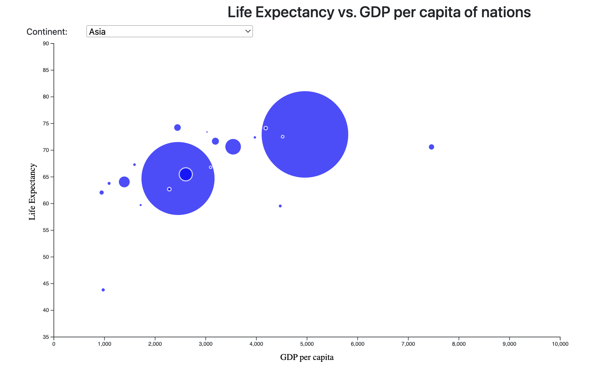
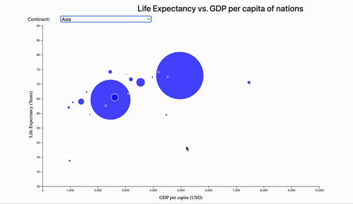
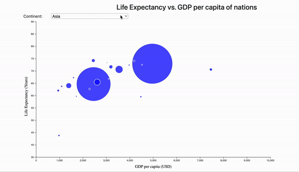

Homework #2: D3 Simple
The purpose of this homework is to teach you some basic grammar and functionalities contained in D3.js:

Loading a dataset
Performing DOM selection
Filtering data attributes
Dynamically update visualized attributes
Creating axes
Using the D3 domain, range, and scale functions
Adding axis labels
Creating circles in svg
Add a tooltip
Basic transitions in D3

Data and Chart Description
This assignment uses one csv files in the data/ folder: data.csv. It has the values of life expectancy, GDP per capita, population and the continent for different countries. In the visualization that you create (see image below), there will be a dropdown listing 4 continents; when the user changes the continent in the dropdown, the life expectency vs. GDP per capita is shown in the form of a bubble chart.

To start the assignment
Clone this code to your local machine.
Using a local server (such as HTTP Simple Server), open the index.html file.
Modify the source code according to the instructions below.
Commit and push the code back to this repository to submit your assignment. The finished page in index.html should look like this:

Assignment Steps
Step 0:
In the HTML file's head section, add your name and email.

Step 1:
In the HTML file, there is a div with the id my_dataviz. Create an svg element inside this div. The svg should have a width of 1000 px and a height of 600 px.

🔍 Note: You can add the svg directly in the HTML or via Javascript in the js/main.js file.

Step 2:
Create a select dropdown element in index.html inside the div element with a class col-3, and add 4 continents from the dataset as options for the dropdown. Use CSS to make the width of the select 100% for the div that it's inside. Then, add code so that, when the country in the select is changed, the draw bubble chart function in js/main.js will be called.

🔍 Hint: There's multiple ways to do this! For example, you could add an onchange event, or create an event listener using Javascript.

Step 3:
In main.js, the data csv file is loaded. Once the data is loaded, store it in one or more global variables so that when the continent changes we don't need to load the dataset again.

Since D3 doesn't have any information about the attribute types of the new files, it interprets every data value as a string. To use the quantatitive columns as such, you'll need to do some data wrangling to convert each row of the data to the correct numeric format. For the 4 continents, change the attribute type from string to numeric. You can also do the converting after you have loaded the data.

Step 4:
Next, create the x- and y-axes for your chart. The x-axis will show GDP per capita. The y-axis will show life expectancy. We will also have a z-axis which will show the population represented as bubble size. For all of the axes, we will use d3.scaleLinear. The y-axis range will be 35-90 years, and the x-axis range will be 0 to the maximum GDP per capita value out of all GDP per capita values.

🔍 Hint: You'll need to use D3 range and domain to do this.

Step 5:
We want to visualize life expectancy vs. GDP per capita of the countries along with the population of the country. For this, we create a bubble chart where centres of bubbles will correspond to values on x and y axes. The size of the bubble will represent population of the country.

🔍 Hint: Give a bit of margin around the outside of your chart so your objects don't run off the edge of the svg.

Step 6:
It’s important to help your audience understand what is going on in the chart. To do this, add titles for your x-axis and y-axis: "GDP per capita (USD)" for the x-axis and a rotated "Life Expectancy (Years)" for the y-axis.

Step 7:
Now, let us make the chart interactive. When the user updates the continent value in the drop down, the chart should be redrawn to show the the countries and the values of life expectanyc vs. GDP per capita for the newly selected continent.

Once you are finished with Step 7 and you have your chart looking similar to the screenshot above, you are done! Be sure to commit and push your completed code by the deadline.

Step 8:

Finally, let's add a tooltip to the bubble chart. When the user hovers over a bubble, we'll display name of the country.

The tooltip should show the name of the country, styled like below GIF (e.g., white background, black rounded border with a width of 2 pixels.The tooltip should follow the user's mouse as it moves along the bubble, and disappear when it's no longer over the bubble. You'll want to use mouse events to control this functionality (mouseover, mousemove, mouseout).

The border of the bubbles should be gray initially but should change to black when user hovers over the bubble (see GIF below).

| 🔍 Hint: There are multiple ways to implement tooltips. One option is defining a div that's hidden unless you are hovering over a bar; when that happens, you populate the div with the necessary info, change its display to visible, and move it to the appropriate position on the so it follows the mouse's x/y position on the page. See this page which for an example: https://bl.ocks.org/d3noob/97e51c5be17291f79a27705cef827da2.

Extra Credit:
Instead of simply redrawing the chart in Step 7 when a user selects a different continent, use D3 transitions to animate bubbles to shrink and disappear for the previously selected continent, and the bubbles for newly selected continent should grow from zero to their full size as shown in the GIF below. This step is worth +2 extra credit points.

Grading
This assignment is worth 10 points.

(1 pt each) Steps 0, 1, 2, 3, 4, 5, 6, and 7
(2 pts) Step 8